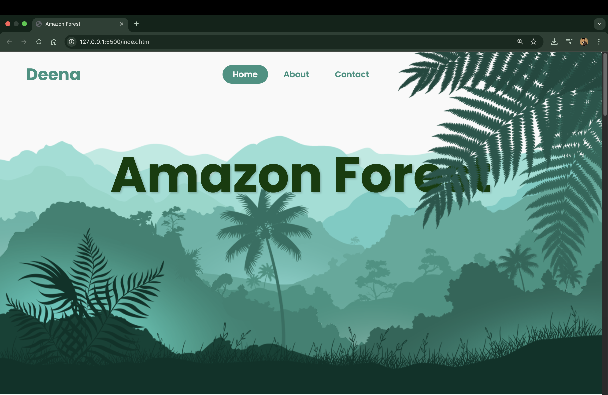
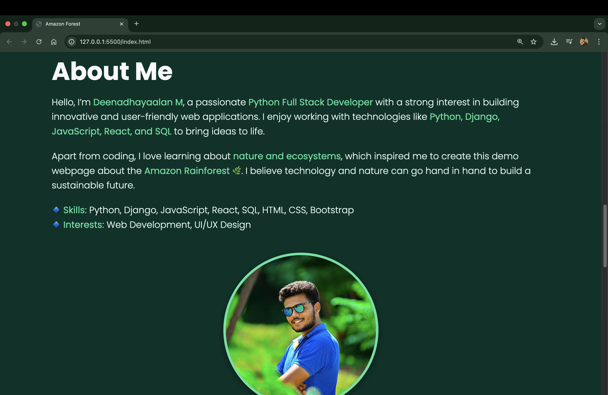
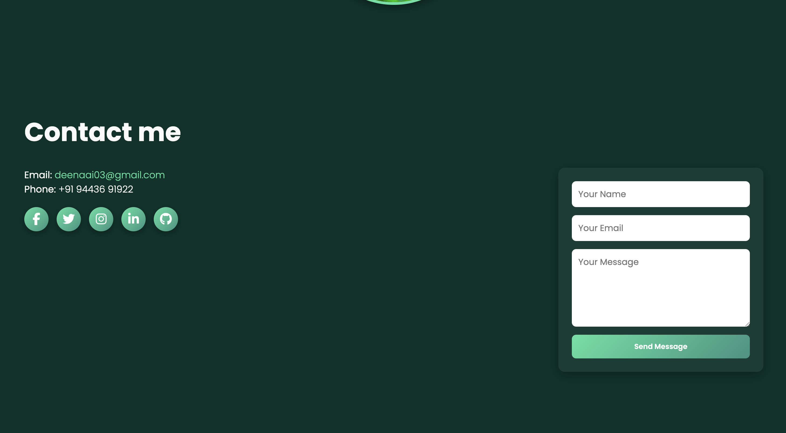

# Parallax-Website-demo
Parallax website Demo website 
# 🌿 Parallax Website Demo

[](https://github.com/deena-m/Parallax-Website-demo)
[](https://github.com/deena-m/Parallax-Website-demo/stargazers)
[](https://github.com/deena-m/Parallax-Website-demo/network/members)
[](https://deena-m.github.io/Parallax-Website-demo/)

A **Parallax Scrolling Website** inspired by the beauty of the **Amazon Forest 🌳**.  
This project demonstrates **creative web design** with smooth parallax effects, interactive UI, and a responsive layout.  

🔗 **Live Demo**: [Parallax Website](https://deena-m.github.io/Parallax-Website-demo/)  

---

## ✨ Features
- 🎨 **Parallax Scrolling Effect** for immersive visual depth  
- 🌍 **Amazon Forest Theme** with vibrant backgrounds  
- 📱 **Responsive Design** (works on mobile, tablet & desktop)  
- 🎵 **Background Sound Toggle** (forest sounds 🌲)  
- 👤 **About Me Section** with profile photo  
- 📬 **Contact Form** with real social media icons  
- 🖼️ **Smooth UI/UX** with professional layout  
- ⚡ **Lightweight & Fast** – no external heavy frameworks  

---

## 🚀 Technologies Used
- **HTML5** – page structure  
- **CSS3** – styling, parallax effect & responsiveness  
- **JavaScript (ES6)** – interactivity & sound toggle  
- **Font Awesome** – real social media icons  

---

## 📷 Screenshots

### 🏠 Home Page


### 📖 About Section


### 📬 Contact Section


---

## 📂 Project Structure
```bash
Parallax-Website-demo/
│── index.html        # Main HTML file
│── style.css         # Stylesheet
│── script.js         # JavaScript interactions
│── assets/           # Images, icons & sounds
│── README.md         # Project documentation
